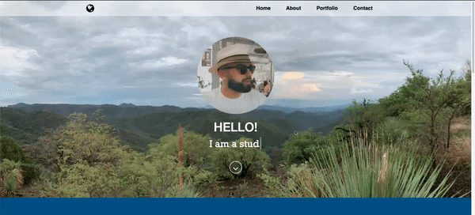

  # Portfoilio
  
 
## Description
🔍 This is my Portfolio. Some information about me including some homework and projects I have worked on.
## Table of Contents
- [Description](#description)
- [Installation](#installation)
- [Usage](#usage)
- [Tests](#tests)
## Installation
💾 Go to my repository and clone my repo.
## Usage
💻 A way of displaying my projects and a way to contact me.
## Tests

